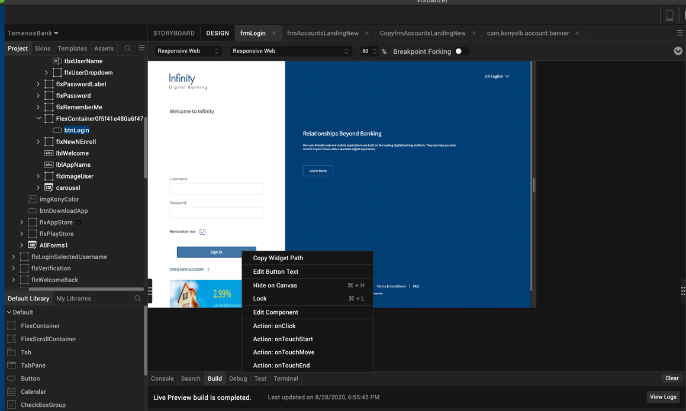
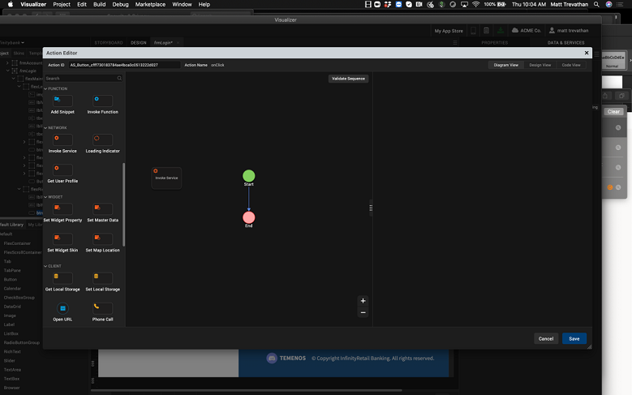

# Module One: Creating an Identity Connector

**Duration**: 30 mins

**Prerequisite Software and Tools**

- [Visualizer 9 SP1](https://community.kony.com/downloads)

- [Kony Fabric](http://Manage.kony.com)

Tasks you will complete in this lab exercise include:
- Import a Visualizer App
- Create a new Fabric app
- Create an Identity service
- Configure user repository provider
- Connect your client app to the identity provider.
- Deploy the Fabric app
- Test the client

## Module 1: Lab Instructions
**Import Your Visualizer Application**

**NOTE** -If you did not attend the previous sessions on building Visualizer client apps, you need to follow the starting steps outlined here.

1. Open Visualizer

2. Import the ScaleApp.zip by selecting, Import > Local Project > Open as New Project.

**Create a New Fabric App**

1. Click the Fabric icon in the left hand navigation.

2. Rename the app "BankingDemoApp" by clicking on the pencil icon to edit the app name.

**Create New Identity Service**

1. Select the Identity tab.

2. Click Configure New.

3. Quantum provides a wide selection of Identity services to connect to. Although the configuration of each service differs, mapping a service to a client app is standardized through the Identity Manager. Choose the User Repository for the identity type. 

4. Name your identity service "BankingIdentity". Click the Save button

**Add a Repository User**

1. We need to add a user to our repository since our repository is empty. From the configuration screen, click the ADD USER button.

2. Provide a login email, first name, last name, phone and password.

3. Click ADD USER

4. You will see that the user was added to your user repository. Make sure to write down the user name and password for the user you created. When we attach our client app to the identity provider, we will use this user to login to our client app.

5. Close the window by selecting the Visualizer icon from the left hand navigation. This will take you back to the client development screens.

6. In the right hand pane, you’ll see the Data and Services tab. Click the Refresh button. This will refresh the services and display your BankingIdentity service under the project services. Now, we can see our banking Identity provider within our app. Let’s connect it to the client app.

**Connect the Client Application to the Identity Service.**

1. From the top navigation, click the design tab next to the storyboard.

2. In the Project tab, select Responsive Web > Forms > frmLogin. This will display the login screen in your IDE. 

3. Right click the login button and select the onTouchEnd() action. This will bring up the action editor window. The action editor window is where we are going associate the onTouchEnd action to our Identity provider. 

4. From the left hand palette, drag the Invoke Service node into the palette. One the node is added, it will appear between the start and end nodes. 

5. Select the BankingIdentity$login operation.  Now, any time someone clicks the sign in button, the login is called. This will select the operation and the method we want to invoke. In this case, we want to login to the identity provider. 
 

6.	Once the BAnkingIdentity$login operation is selected, click the Open the Mapping Editor link. From here, we will map our request parameters to our input fields on our form.

7.	Now, we need to map the text property from the username text field to the username parameter for the login. Click the text property for under Forms > Loginfrm > Component Instance main > tbxUsername > text

8.	Now click the userid parameter on the identity service. Notice, the line that point from the username on the form to the userid on the service. This indicates the fields are mapped. 

9.	Next we need to map the password text field to the password parameter on the service. Click the text property for under Forms > Loginfrm > Component Instance main > tbxPassword > text

10. Now click the password parameter on the identity service. Notice, the line that point from the password on the form to the password on the service. This indicates the fields are mapped. 

11. Now, we need to navigate to our dashboard page once a login is successful. From the pallet, drag a navigation node onto the workflow over the success node. When a call is successful, we want to navigate away from the login page.

12.	In the Screenshot, the form is already selected. To select the form, click the form in the right hand pane to navigate to. In our case, we will navigate to the frmAccountsLanding page.

13. Now we need to add an alert box if the user fails to authenticate. From the Left hand palette, drag an alert box over the failure node. 

14. Change the Alert Type to Error

15. Change the Alert Title to “Invalid Login.”

16. Change the Alert Message to “The user name and/or password you entered is incorrect.”

17. Click save. Your app is now mapped to the Identity service. Let’s get ready to test our app by deploying the Fabric app to a Fabric runtime. 

**Deploy Fabric App**

1. Before you can run the client application, you need to deploy the Fabric application that exposes the services on Quantum Fabric. When we were in the Fabric console, we were configuring the identity provider, but we can’t use the configuration until it is deployed to a Fabric runtime.  From a web browser, connect to the following url: http://manage.kony.com. 

2. Using the credentials you used to register your fabric account, login with your credentials. NOTE – These are not the credentials you setup in your user repository within Fabric. These are your cloud credentials you registered with to download Visualizer and create a community edition of Kony Fabric.

3. Select the Banking Demo App from the console dashboard.

4. Select the Publish tab.

5. The Publish tab shows all the available environments you can publish to within your account. In my case, I only have one environment to publish to, XAI POC. Click the greyed out circle with a check beside the instance you want to deploy to. When you do, the checkmark will and circle will turn blue  for that instance. 

6. Click the Publish button.

7. When the application is published, the publication window will show a green checkmark. 
 

8. Close your browser.

**Run the App in Live Preview**

9. Return to Visualizer. Let’s run our client app locally using Visualizer’s preview mode. 

10. From the top menu, select Build > Live Preview Settings

11. Ensure the responsive web checkbox is selected

 
12. Click Save and Run.

13. This will locally compile your app as a responsive web app and start the preview browser.

14. Login to the application suing the credentials you created in the first part of this lab u=in the user repository.
15. If you are successful, you will successfully navigate to the dashboard form.

**Module 1: Lab Summary**
In the first module we imported a Visualizer app into our workspace. Then we learned how to create a Fabric app and Identity service using the user repository that comes with Quantim Fabric. Next we connected the client responsive web application to the identity service we created in Fabric. Once completed, we deployed the Fabric app and ran the client app from Visualizer. At this point we will move on to Part 2 and connecting your application to a Temenos Microservice. 

Access [Module 2](https://github.com/temenos/SCALE2020/blob/main/An%20Introduction%20to%20Quantum%20Fabric%20Capabilities%20and%20Microservice%20Integration/Module2-ConnectingAnObjectService.md)

**Rate Temenos SCALE**

Let us know how we did via our [Feedback Survey](https://forms.office.com/Pages/ResponsePage.aspx?id=D1TS1Qr2rUWGqeLnku5maQm4GcDXBTFLrQ1exd1wB_1UOTY4SFZISzRLQjU4QVVRSjlUSzExRk1CNi4u)

Get Involved in the Temenos Developer Community at [Base Camp](https://basecamp.temenos.com/s/base-camp-welcome)