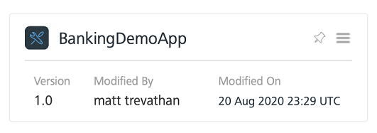
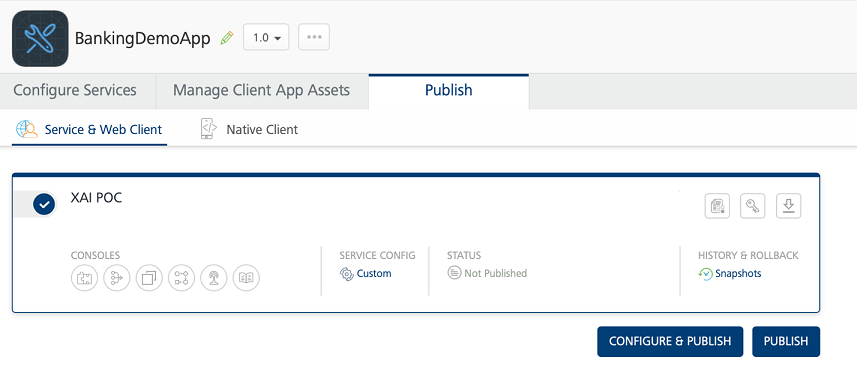
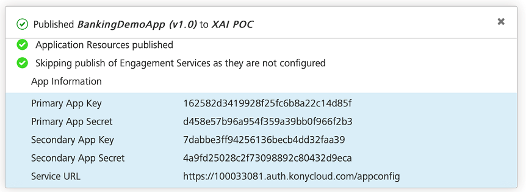

# Module Two: Connecting an Object Service
**Duration**: 30 mins

**Prerequisite Software and Tools**

- [Visualizer 9 SP1](https://community.kony.com/downloads)

- [Kony Fabric](http://Manage.kony.com)

Tasks you will complete in this lab exercise include:

- Import a Visualizer App
- Create a new Fabric app
- Create an integration service
- Add an operation
- Create an Object service
- Testing your object service
- Deploy the Fabric app
- Connect your object service to your client app
- Run Live Preview

## Module 2: Lab Instructions

**Create a New Fabric App**

1. Open Visualizer

2. Click the Fabric icon in the left side navigation.

 
3. Your client app should already be linked to a Fabric app since a fabric app is automatically created when we created our identity service in the [last module](https://github.com/temenos/SCALE2020/blob/main/Lab%206%20-%20Intro%20to%20Quantum%20Fabric/ModuleOne-CreatingAnIdentityConnector.md). Here is my BankingDemoApp. Note- IF you create a new app, Fabric defaults the name of the Fabric app to match your Visualizer app.

**Create New Integration Service**

1. If your integration tab isn’t selected, select the Integration tab.

2. Click Configure New.

3. Enter MarketServices for the Name. This will be the name of the integration service, and it represents the request and response to the back end that we will map to the object model later in the module. 

4. Quantum Fabric allows users to choose from a variety of back end services to expose to the end user, including JSON,XML,SOAP and many others. This allows a developer to select many different types of integrations and expose them as RESTful JSON services to end user experiences. Select JSON for the service type in the dropdown.

5. Enter [https://qjrs5ffz2j.execute-api.us-east-2.amazonaws.com/test-sone](https://qjrs5ffz2j.execute-api.us-east-2.amazonaws.com/test-sone) for the base URL. This points to the Temenos microservice base marketing microservices.

6. Click Save and Add Operation.

**Add An Operation**

1. In the Name text field, type Products. 
 

2. In the suffix field, add the following: /v2.0.0/product/ADVANCED.CHECKING.ACCOUNT/currencies/USD

3. For this operation, we need to fetch some data, so we will keep the target HTTP method as GET.

4. In the Request Input section, select Header. It’s **very important** you select the Header

5. Select the Add Parameter button. We need to add an API key in the session header.

6. For the name of the key, type x-api-key.

7. For the default value, type `kSXstPJMY86SCV81K0aQ53AqVFr3Radf7BkQ4RY1`. This value is the key for the Temenos Marketing Microservice.

8. Click the Save and Fetch Response button at the bottom of the screen. This will return a backend response. 

9. Check to make sure your Backend Response returned a JSON object in the Backend Response pane that is visible after you clicked the Save and Fetch Response button. If there isn’t a response. Click the Save and Fetch Response button a second time.  Notice at this point, there isn’t any output in the output result. Filter the backend response into our output result that the integration service response with. 

10. From the center panel, find the products node and right click the node and click Create response.

11. This will fill the output response inside the service mapping with all the attributes within the product node, including any arrays of objects on any sub-nodes. We don’t need all the information provided, so let’s remove some of the data to create a concise response. Let’s remove all the data below the extensionData by clicking each field from Extension data to the last field in the response and click delete. 

12. Once the attributes are removed, the screenshot above shows the remaining attributes we want to keep. Click Save and Fetch.

13. Look in the output result panel. Now, the result returns the attributes we filtered from the backend service call to create a concise response for our multi-experience apps. Now, we have an integration service that we can connect to our app.  In the next section, we will decouple the backend integration service with our client app using an object service. 

**Create an Object Service**

1. Select the Objects tab. 

2. Select Configure New.

3. Name your Object service Marketing. 

4. Select Integration & Orchestration Service for the endpoint type. There are a number of other services we can map directly into an object that you can see if you pull down the drop down, included mapping to relational databases. In our case, we created an integration service to the backend we want to map to, so we select the Integration & Orchestration Service.

5. Click the Save and Configure button.

6. At this point, we have an object service without any object. Notice in the left side panel, we don’t have a data model yet. The data model defines how a client app maps request and response data into the Fabric app.  You can configure your own data model, even if the back end doesn’t exist by clicking the configure New button, but let’s generate a data mode from our existing Integration service. Click the Generate button.

7. Next, create an object named MKTProducts. 

8. Let’s use the service we created in the last step/ Select your MarketingServices and find the Product operation. 

9. Click Generate.

10. Now, our data panel has a data model. Click the mapping tab. 

11. Now, we need to map our backend service to our data model. Click the productDescription in the left

12. Let’s map the GET verb to our service. Select GET from the Data Model Verb drop down.

13. Select the MarketServices service from the Services dropdown.

14. Select product from the Operations dropdown

15. Click the add mapping button.

 
16. The Fabric console displays the current mapping between our prodDescription object and our backend services. Click the Response Mapping tab.

17. Click the Edit button.

18. Drag the mapping from the Service on the left to the object on the right until each attribute is mapped. 

19. Once all the attributes are mapped, click save.

**Testing our Object Service**

1. Now, we can test the service. Click the Test Tab.

2.	Click Send.

3.	When we send the request to the object service, the object service calls the integration service, and the response is mapped back into the response of the object service. 

4.	Now that the services are configured, let’s deploy our app.

**Deploy Fabric App**
1.	Select the Publish tab.

2. The Publish tab shows all the available environments you can publish to within your account. In my case, I only have one environment to publish to, XAI POC. Click the circle beside the instance you want to deploy to. When you do, A checkmark will appear for that instance.

3.	Click the Publish button.

4.	When the application is published, the publication window will show a green checkmark. 
 

5.	Close your browser, and open your Visualizer app.

**Connecting the Object Service to Your App**

1. Let’s pick up our app where we left off on the identity module. Select the Data & Services Tab.
2. Hit the Refresh button 

3. Notice from this screen, we can see both the integration service and the object service.  If we deleted the integration service at this point, the object service would remain, and we could map a new service to the object service without needed to remap the service to the client app.  If we chose the integration service here, and changed the service, we would need to map the client to the new service that may now have the same field names that the previous service did. 

4.	In the left side navigation, click Responsive Web > Forms > frmTerms. This will bring up the terms and conditions page. 

5.	In the right hand panel, make sure you’re on Panel, make sure you’re on Data and Services. 

6.	Find your object service you created in the previous steps. If there aren’t any services when you expand the Project Services tab, hit the refresh button and it will refresh the services. 

7.	Expand the project services and click the ProdDescription microservice we created.

8.	Drag the get operation onto your terms and conditions form. 

9. Once you drag the get operation on the screen, Visualizer will give you 3 options for mapping the data. The first option will autogenerate a List & Details template to show the data, the second will present the data in an autogenerated grid layout. The third options will let us map the data from the response to the form. Choose Detail Using Response.

10. Now, drag the detailedDescription from the data panel into the first text box under the Advance Checking Label.

11.	Now drag the termsConditions attribute onto the second text box.

12.	If you want to see the client side workflow generated by Visualizer, select the properties in the right hand tab.

13.	Select Edit on the onMapping action. This will bring up the workflow.

14.	You can see that Visualizer created a number of workflow steps. If you want to edit any of the steps, you can easily edit the workflows from here.
15.	Hit cancel or save. Now, let’s look at our app in Action.

**Run The App In Live Preview**
1.	From the top menu, select Build > Live Preview Settings

2.	Ensure the responsive web checkbox is selected

3.	Click Save and Run.

4.	This will locally compile your app as a responsive web app and start the preview browser.

 
5.	Login to the application suing the credentials you created in the first part of this lab in your user repository.

6.	If you are successful, you will successfully navigate to the dashboard form. 

7.	From the dashboard, click the advertisement, and it will load the terms page with the text fields filled with data from our object service.

**Module 2: Lab Summary**
In this module, we created an integration service that exposes a backend service as a REST based service for application. We also learned how to decouple our backend integration service from our front in client app by building and deploying an object services that we mapped to our client app. In the next module, we will learn how to create a light weight workflow with Fabric workflow engine.

Access [Module 3](https://github.com/temenos/SCALE2020/blob/main/An%20Introduction%20to%20Quantum%20Fabric%20Capabilities%20and%20Microservice%20Integration/Module3-CreatingAQuantumFabricWorkflow.md)

**Rate Temenos SCALE**

Let us know how we did via our [Feedback Survey](https://forms.office.com/Pages/ResponsePage.aspx?id=D1TS1Qr2rUWGqeLnku5maQm4GcDXBTFLrQ1exd1wB_1UOTY4SFZISzRLQjU4QVVRSjlUSzExRk1CNi4u)

Get Involved in the Temenos Developer Community at [Base Camp](https://basecamp.temenos.com/s/base-camp-welcome)
