# An Introduction to Quantum Visualizer for Multiexperience App Development

**Prerequisite Software and Tools**

- [Visualizer 9 SP1](https://community.kony.com/downloads)

- [Kony Fabric](http://Manage.kony.com)

- Quantum App (Available on the [Apple Store](https://apps.apple.com/us/app/temenos-quantum/id1459085071) / [Google Play](https://play.google.com/store/apps/details?id=com.kony.FunctionPreviewApp&hl=en_GB&gl=US)

1.	Download and install Visualizer.

2.	Download Temenos Quantum app on your phone from Apple/Google stores.

3.	Documentation link to get started - https://basecamp.temenos.com/s/getting-started 

4.	Download starter package for the exercise - DonutChartExport.zip & SCALE_import.zip

5.	Create a Temenos Fabric account if you are not a registered developer using https://manage.kony.com/registration. 

6.	Login to Visualizer using your Temenos Fabric account. 

**Duration**: 30 min

**Create a new Visualizer application**
1. Launch Visualizer

2. Click the Project menu and then click New Project. The What do you want to start with now? screen of the New Project wizard appears.

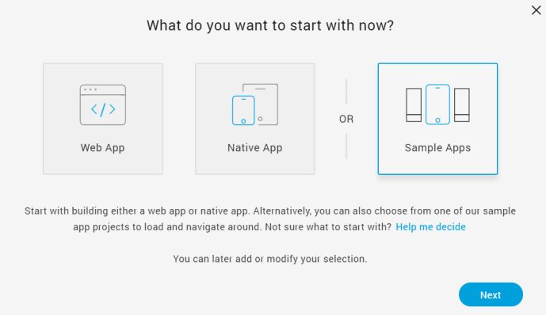

3. Select Native App in the wizard and provide project name of your choice. This document will use the project name as TemenosBank. Select Create to generate a new application in Visualizer.

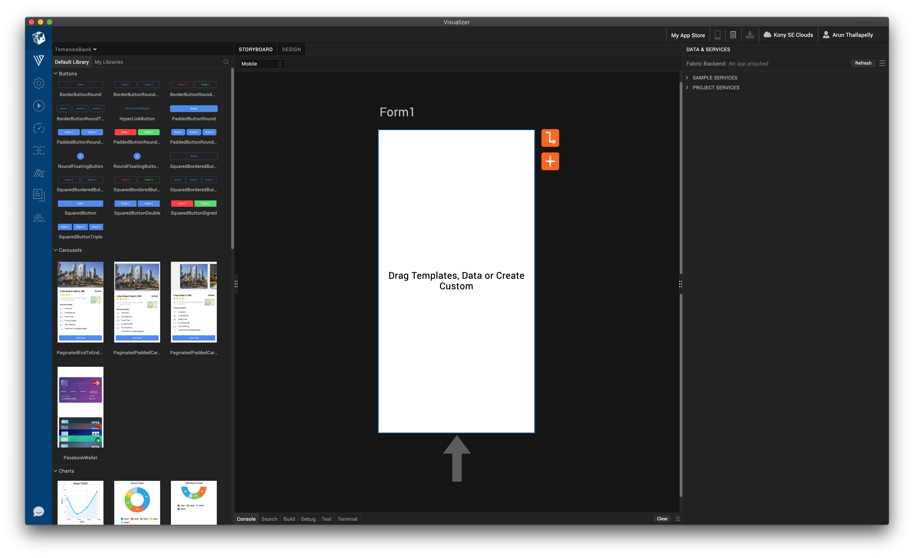

## Getting started with Quantum Visualizer 

Purpose: This lab focuses on leveraging Temenos Quantum Visualizer to create multiexperience applications. This workshop provides an overview of Visualizer and demonstrates how to use it to build native and web applications. After completing the lab, you should be able to:
- Build native and web applications
- Create and use Visualizer UI widgets and components
- Publish prototypes and use Quantum app
- Generate binaries for native and web

Tasks:	Tasks you will complete in this lab exercise include:

- Create a Visualizer application
- Create a native and web form from scratch
- Create and reuse components
- Preview application during development
- Publish application as a prototype
- Review prototype as a stakeholder
- Generate binaries for native and web

## Module One: Lab Instructions 

**Quantum Visualizer Orientation**

1. The application first opens in the Storyboard view. You can view the different forms inside the app and their connections in this view. To view the Properties of each widget in a form, double click on any form to go to the Design View. You can also select the Design tab to navigate to the Design View.

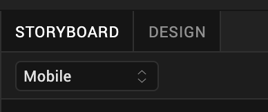
 
2. Project structure should now be visible on the left panel of the Visualizer. The Project explorer contains options to create apps for mobile, tablet, responsive web and wearable form factors. Using the form in each channel, you can create the user interface of an app.

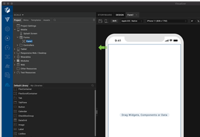

3. The Canvas is the work area where you design an app. By selecting a device and a platform from its drop-down menus, you can view how your app UI will look on a device without leaving Quantum Visualizer.

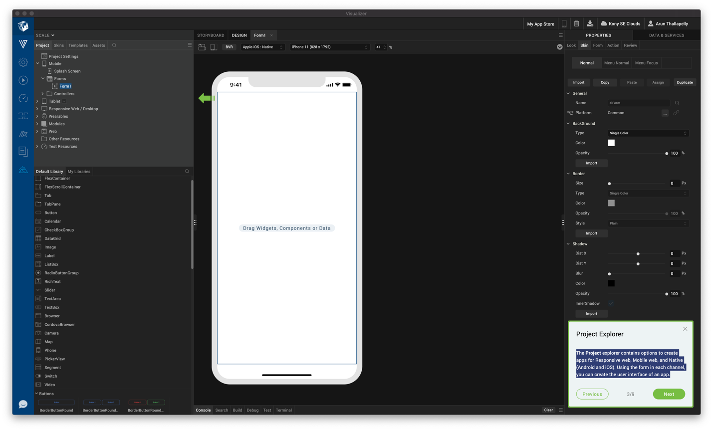

4. The Default Library is a collection of widgets, UI components, and icons. The components are the building blocks that allow you to create an app. The icons and components are grouped based on their usage. Explore the collection by scrolling the list or use the search option for finding anything specific.

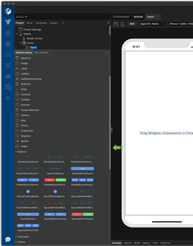

5.	The Properties panel on the right of Visualizer lets you change the layout and the look and feel of the forms and widgets on the Canvas. 

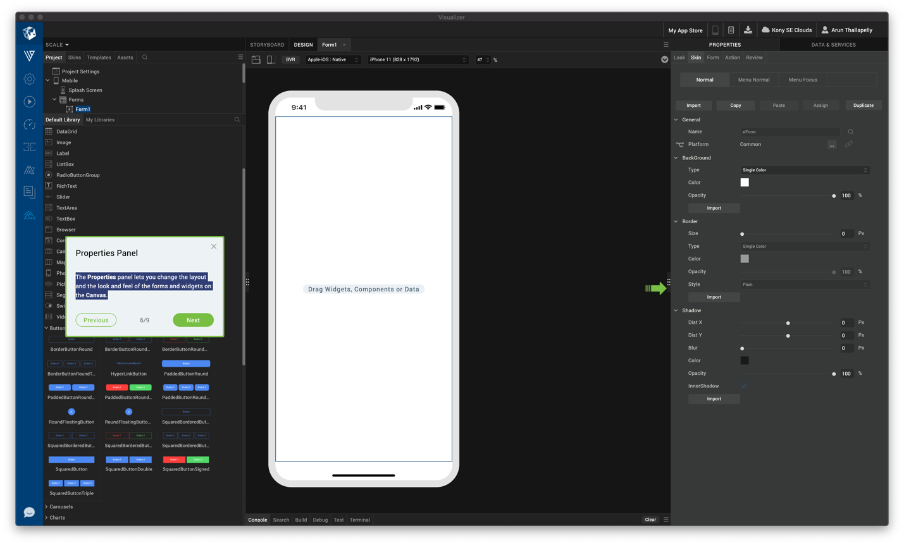

6. The Data & Services panel, also on the right, enables you to link the back-end data services to your app's user interface elements. The sample services in the Data & Services panel helps you to add a service to your app.

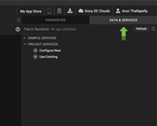

7.	The bottom section under the canvas houses Console,  displays the running record of Quantum Visualizer's every activity. It also informs you of any failed action by showing an error while you initialize services, build your app or launch it.

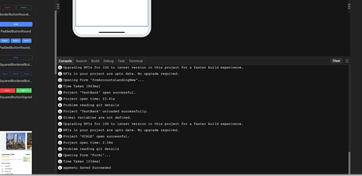

8.	The Build menu helps you to preview your app or build and publish it to your Quantum Cloud account. You can either preview your app live or on the Quantum App.

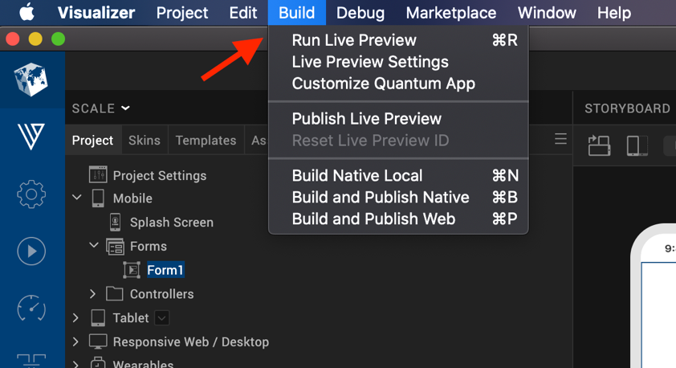

**Drag and Drop to build the UI**

1. Right click on Form1 in the project explorer and rename the form to Login. To save the current work, use ctrl + S / cmd + S.
2. To start creating UI for mobile and other form factors, From the Default Library tab on the bottom left of your canvas, start by dragging and dropping a widget/collection of choice into the device shown on the canvas. Tip: Use Hikes to revisit any basic concepts from the left panel 

3. For this exercise, drag and drop the FlexContainer widget onto the Login form on the canvas. Select the newly added FlexContainer widget from the Project explorer on the top left of your canvas. Right-click on the FlexContainer and rename flxHeader.

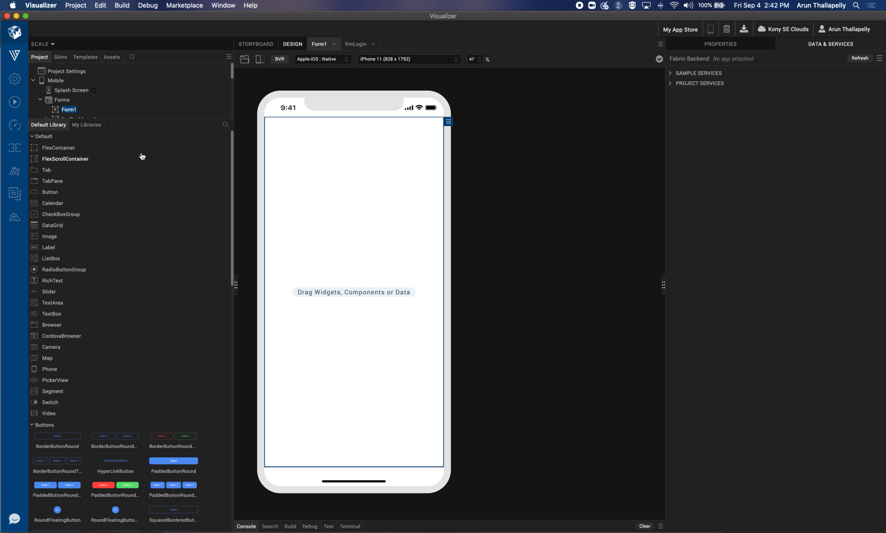

4. Position the flxHeader into postion using the Look subtab under Properties on the right panel. Since this will serv as our header, we want it at anchored at the top. Set the Left and Top Values to 0Dp. Width and height can be precisely adjusted to requirements, but the defaults are excellent for our walkthrough.

5.	Now, drag and drop an image widget into the flxHeader, rename it to imgHeader and apply the positions as in the screenshot below:

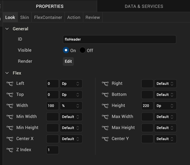

6. Switch over to the Image tab or double click on the image widget in the canvas to set the image to a logo of your choice. For this example, we are using the following image.

**Customize our Skins**
1. For this section we’ll explore using Skins tab for the widgets to add some color to our app.
2. Please import the starter application from <git>. Use Project > Import > Local Project > Add to Current Project > From an Archive and point to the archive downloaded from Git.

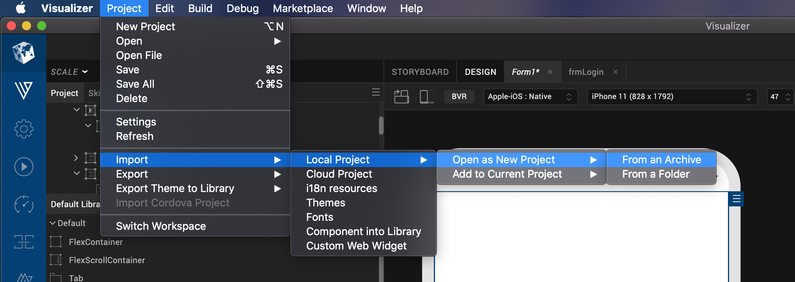

3. Select the Login form and switch to Skins tab under properties on the right panel.
4. Use the dropdown for Background type and select Image. Using the Browse option, click next to default and search then select loginbgradient.png as the option.

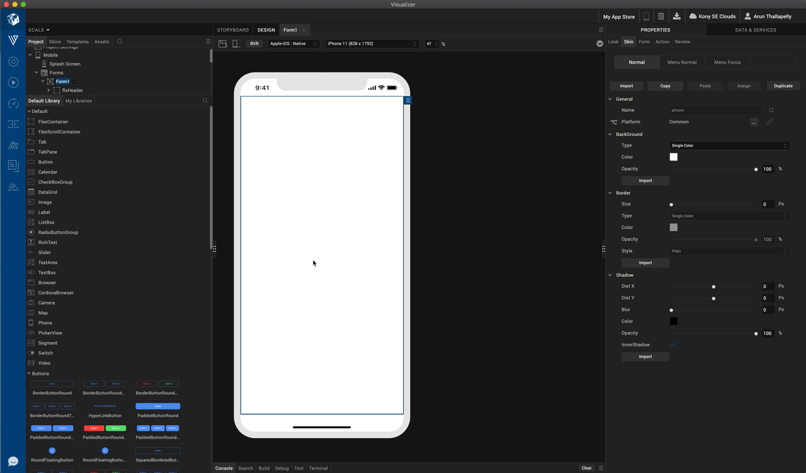

**Using Components to rapidly build you UI/UX**

1. For this section we’ll explore using components to rapidly accelerate the pace of UI creation. 
2. From the upper-left corner of Visualizer, in the Project explorer, expand Mobile > Forms and select the Contact form.
3. Go to the Templates explorer and expand Components > scale2020.login.welcome.
4. Right-click on the scale2020.login.welcome component and select Insert into.
5. The component is now added to the Login form.
6. Repeat the steps for the following components to complete the Login form.
- scale2020.login.contentmain
- scale2020.login.loginfooter
- scale2020.login.adplaceholder

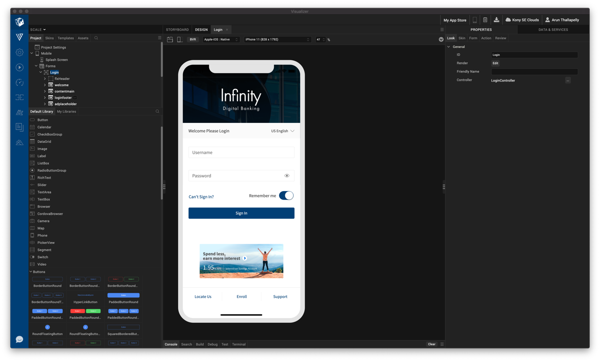
 
7. At any point during the UI creation, you can switch between operating systems and their corresponding device types from the toggles in the canvas

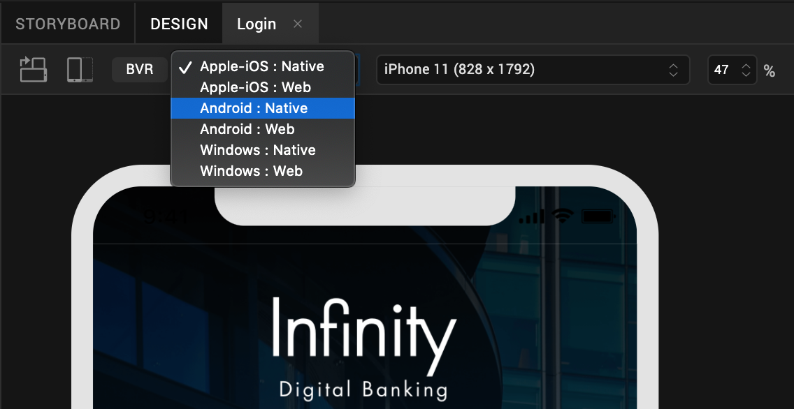

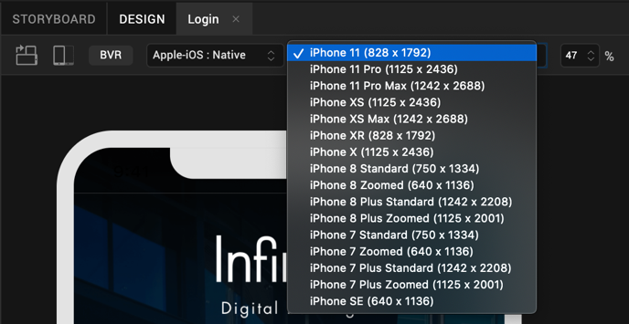

**Preview/Build the App**
1. For this section we’ll explore using Live Preview on your Quantum app running on your device to quickly review the progress of the app we are building.
2. From the main menu, go to Build and select Live Preview Settings.
3. In the Live Preview Settings window, under Native, select checkboxes next to OS of the mobile device on which you are going to view the app. For example: iOS and Android
4. Ensure that you have unselected the checkboxes for other platforms and channels that you don’t intend to build or haven’t created any forms.
5. Click Save & Run.

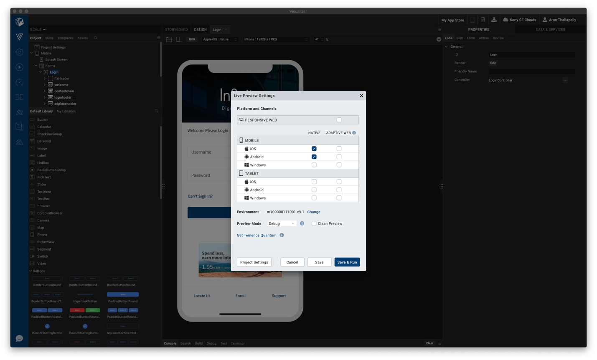
 
6. It may take some time for the Visualizer to show the Live Preview is ready window.

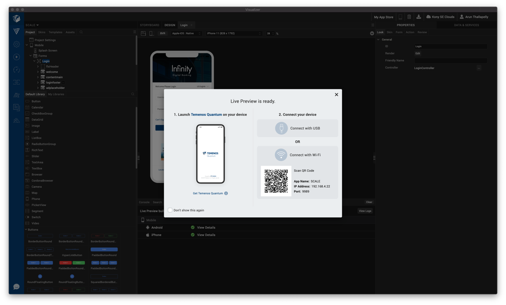

7. Connect your mobile device to your computer using a USB cable or make sure you are on the same Wi-Fi network.
	o If using USB, for Android mobile device, ensure that the use of USB is Transfer files.
	o If using USB, for iOS mobile device, ensure that a trust has been established between your device and your computer.
8. Launch the Quantum App on your mobile device.
9. Select the USB/Wi-Fi option.
10. On successful connection, the Visualizer on your computer shows a success prompt.
11. Click Connect.

**Responsive Layout**
1. For this section, we’ll use Responsive Grid Layout to quickly build the login page. The Responsive Grid layout divides the container widget into columns based on the value of the Span property. The maximum number of columns is twelve. The Span property sets the width of the child widget based on the 12-column layout. The Offset property determines the position of the left edge of the widget. This position is measured either from the left edge of the parent widget or from the right edge of the widget present to its left. Please see docs link for more information on [Responsive Grid Layout](https://docs.kony.com/konylibrary/visualizer/visualizer_user_guide/Default.htm#ResponsiveGridLayout.htm).
2. Let’s begin by creating a new form under Responsive Web section of the project.  

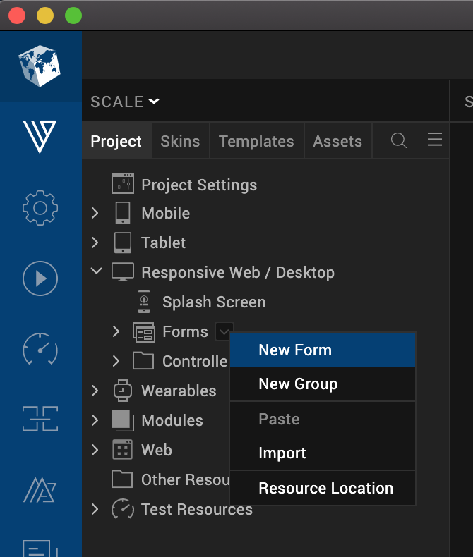

3. Rename the form as Login. Notice the responsive break points for the form under properties. These are used to create or edit breakpoints you would like to use during design phase for quick switch.  

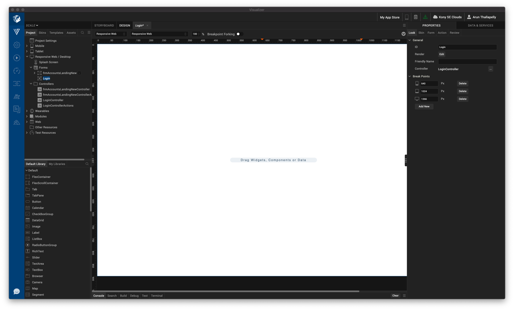

4. Tab over to Skin under Properties and edit the Background. Switch the type to Two Step Gradient. Select the color at start position, use the Hex color code: 003e75 and the end position, use the Hex color code: 1e588b. Finally select Apply to enable the skin. 

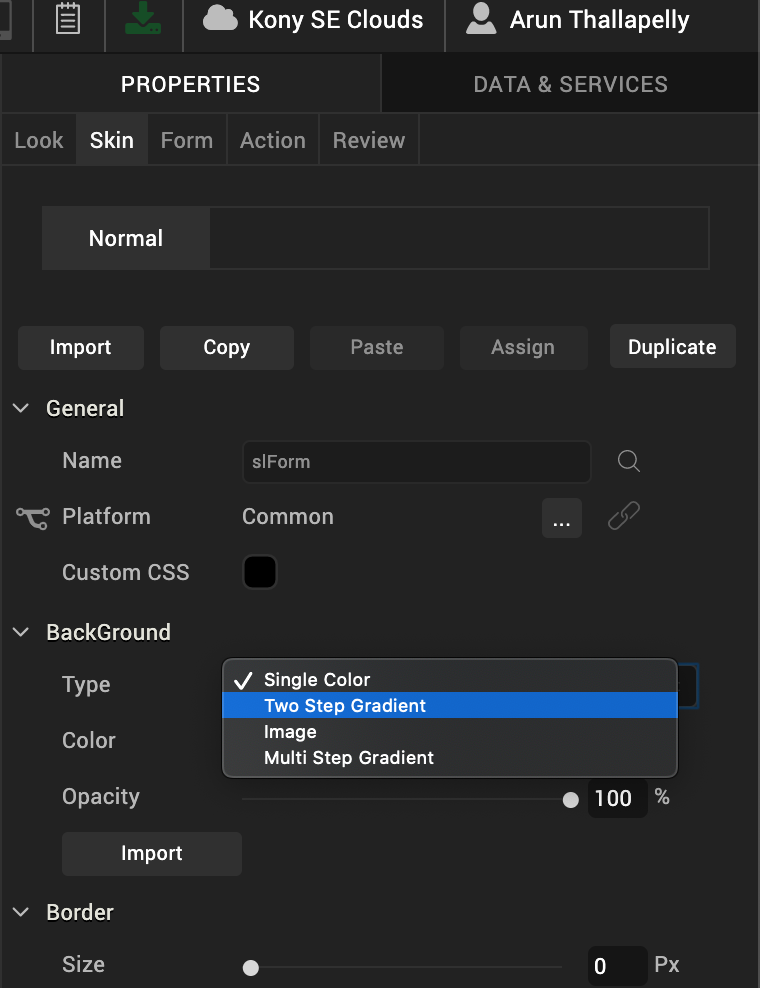
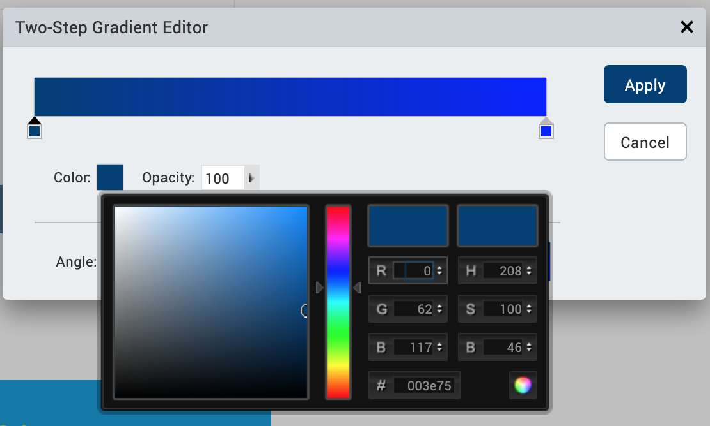 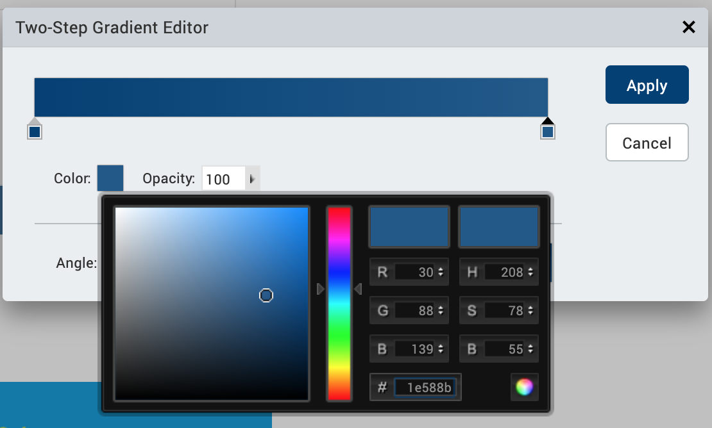 

5. Tab over to Form under Properties and edit the Layout type property to Responsive Grid.  

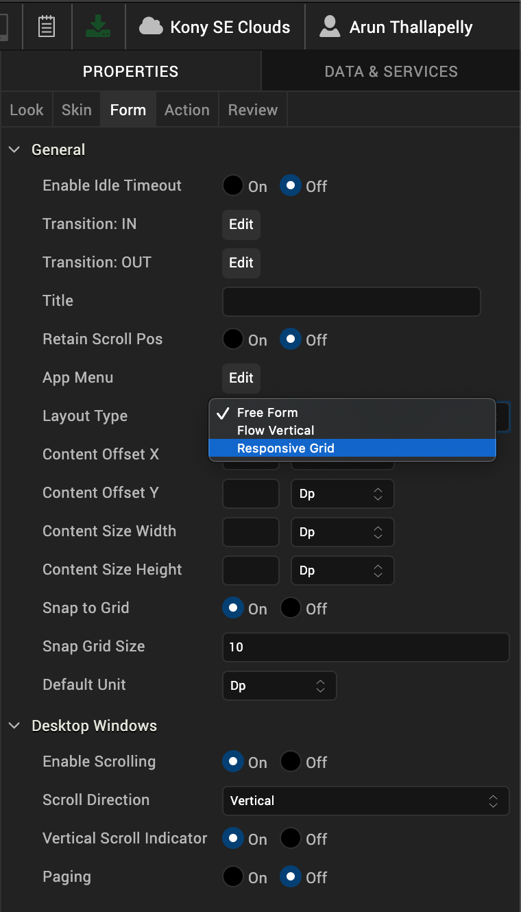

6. Drag and drop a FlexContainer from the Default Library onto the Login form. This container will automatically snap to the top-left corner of the form because of the responsive grid layout model. Notice the Properties>Look section to find the Responsive Configuration of this flexcontainer.
7. Edit the properties of the flexcontainer as per the screenshot below. 

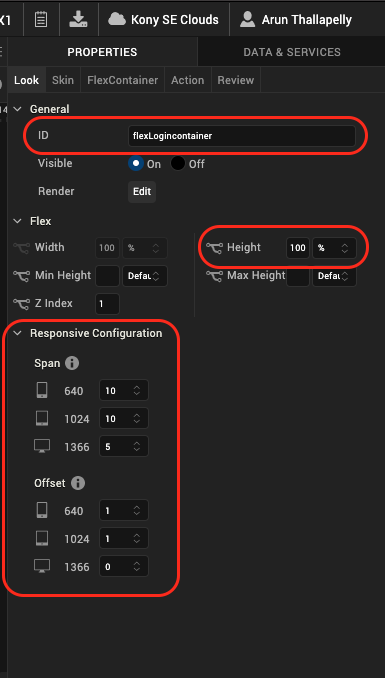

	Id: flexLoginContainer
	Height: 100%
	Span:
	  640:  10
	  1024: 10
	  1366: 5
	Offset:
	  640:  1
	  1024: 1
	  1366: 0
	  
8. Switch to Templates and search for the login component – com.konyolb.login.main. Right click on the component and select Insert Into to import the component into flexLogincontainer.

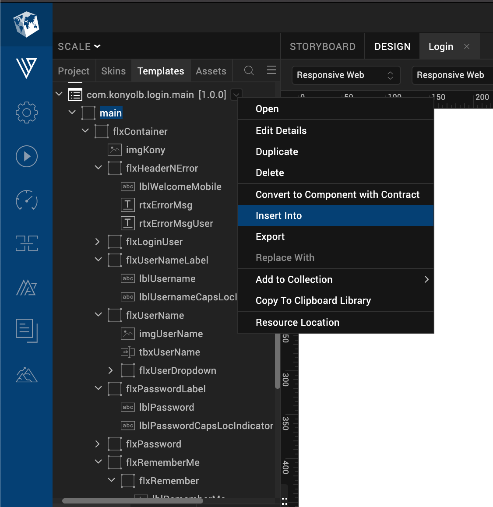

9. Drag and drop another FlexContainer on the Login Form and apply the following responsive configuration as below

 

	Id: flexRightContainer
	Height: 100%
	Span:
	  640:  0
	  1024: 0
	  1366: 7
	Offset:
	  640:  0
	  1024: 0
	  1366: 0

10. Switch to Templates and search for the login component – scale2020.loginrightcontainer. Right click on the component and select Insert Into to import the component into flexRightContainer.
11. Now that your login page is ready, you can use the grid switch option on the canvas to review your UI layout between various screen sizes.

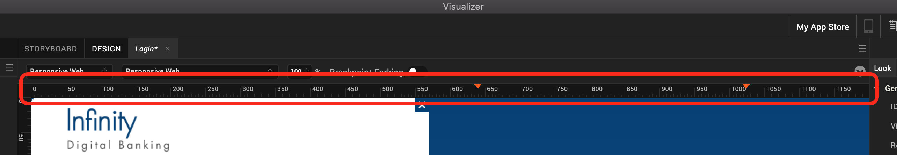 

**Action Editor**

1. In this section we’ll enable some quick actions to navigate between our UI. 
2. Select the Sign In buttons on the login screens for mobile/responsive web and navigate over to Properties>Action>OnClick>Edit or simply right click on the button to and select Action:OnClick

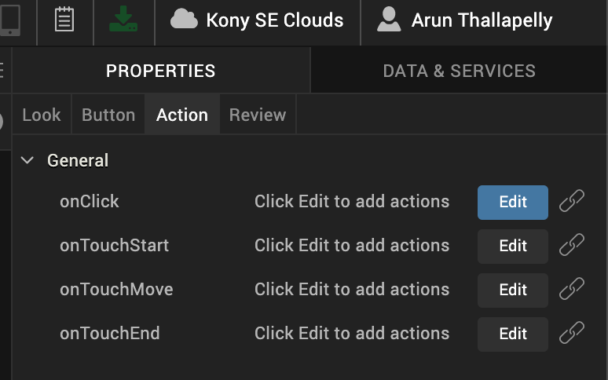
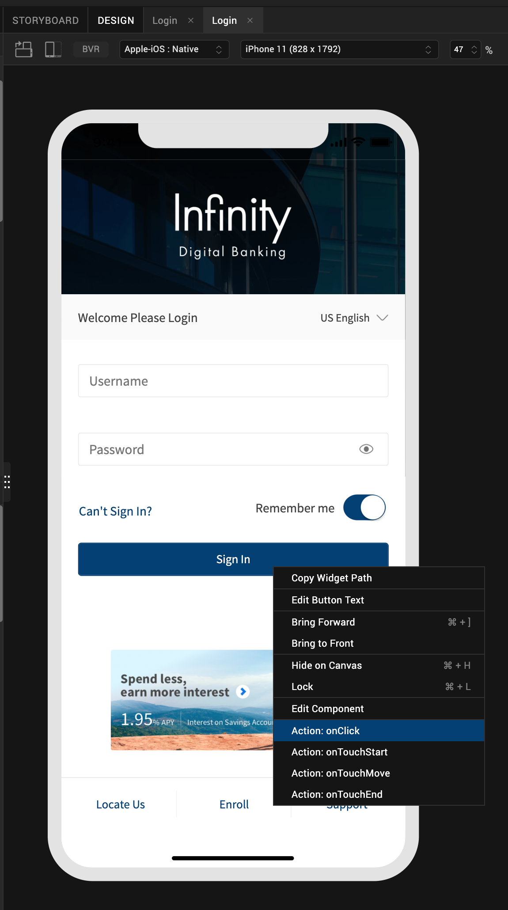

3. This will enable Action Editor where you can perform various business logic actions using workflow model, or design model and review the JavaScript code the tool generates.

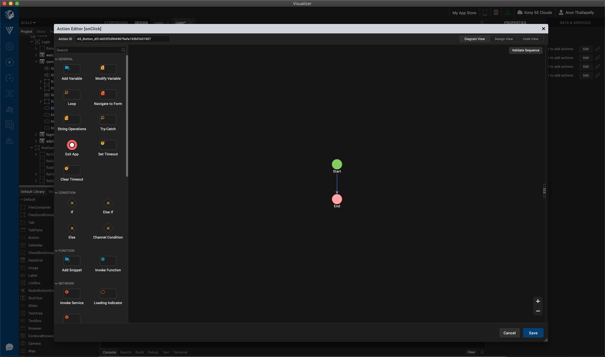

4. Select or drag and drop Navigate to Form option from the left panel to add it to the logic. From the additional arguments panel that pops open, select the form you would like to navigate to.

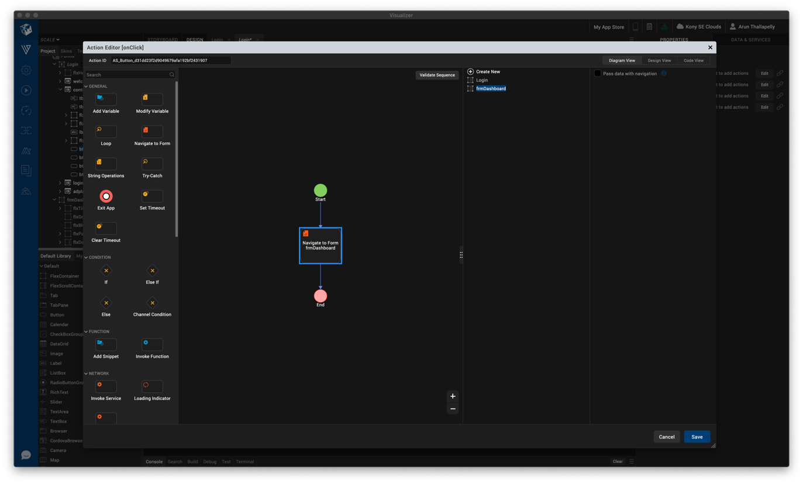

5. Repeat the process for other forms and enable navigation as needed.
6. You can further add complex business logic using the other options provided in the Action Editor. To learn more, please see our documentation [here](https://docs.kony.com/konylibrary/visualizer/visualizer_user_guide/Default.htm#working_with_Action_Editor.htm).

**Import 3rd Party Libraries**
1. Using the built in Nitro framework, you have the freedom and flexibility to bring in 3rd party libraries and frameworks to enhance the user experience of your Visualizer built applications.
2. Use the main menu -> Project -> Import -> Custom Web Widget -> DonutChartExport.zip to import the Donut Chart 3rd party charting library into your application. This Donut Chart will render the PFM data in the Responsive Web section of your application.

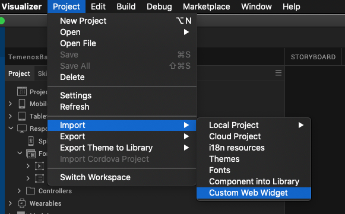

3. Once successfully imported, you should be able to see the widget added under default library

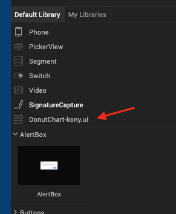

4. You can, just as with any other widget, drag and drop this into the UI.
5. For your convenience, the code was already setup under frmAccountsLandingNewController.js -> initlizeDonutChart(). 
6. Repeat live preview steps to review the app with clean build to validate the 3rd party charting library now integrated and working in the application.

**Publish your app**
1. Use Live Preview steps from Step 7 to review the new changes to your application.
2. Once ready to publish, From the main menu, select Build.
3. Click Publish Live Preview. The Publish Live Preview window appears. From the Publish Live Preview window, under Mobile, select the checkboxes next to the OS of the mobile device on which you are going to view the app. For example: iOS and Android under Mobile. Ensure that you have unselected the checkboxes for all the other platforms and channels.

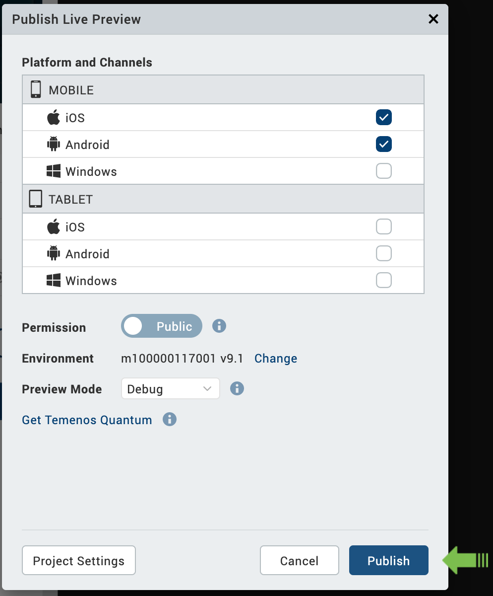

4. Click Publish.
5. After the app is published, the Live Preview is ready window appears.
6. Quantum Visualizer proceeds to publish the app, as indicated by the progress bar. Once the application is uploaded to your Quantum account, a publish code is generated as shown here. 

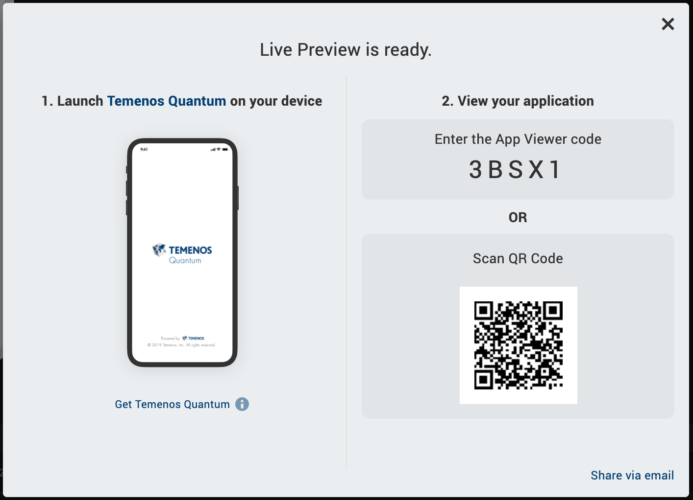

7. Launch the Quantum App on your mobile device.
8. Select the Cloud tab.
9. In the 5 Digit App Viewer Code input box, enter the App Viewer Code from Visualizer.
10. Alternatively, from Quantum App on your mobile device, go to the Cloud tab and click SCAN QR CODE. Allow camera access to the Quantum App. Scan the QR Code displayed on Visualizer to view the app.

**Build for Web & Native**
1. The Build and Publish Web App action publishes the application to your Quantum Fabric environment and enables you to view your app by providing a link. The Build and Publish Web app option also publishes the Quantum Fabric app to the Quantum Cloud. To publish an app to the Quantum Cloud, logging in to your Quantum Account is mandatory.
2. To access this use the Build > Build and Publish Web option. Select responsive web as the option and hit Build.

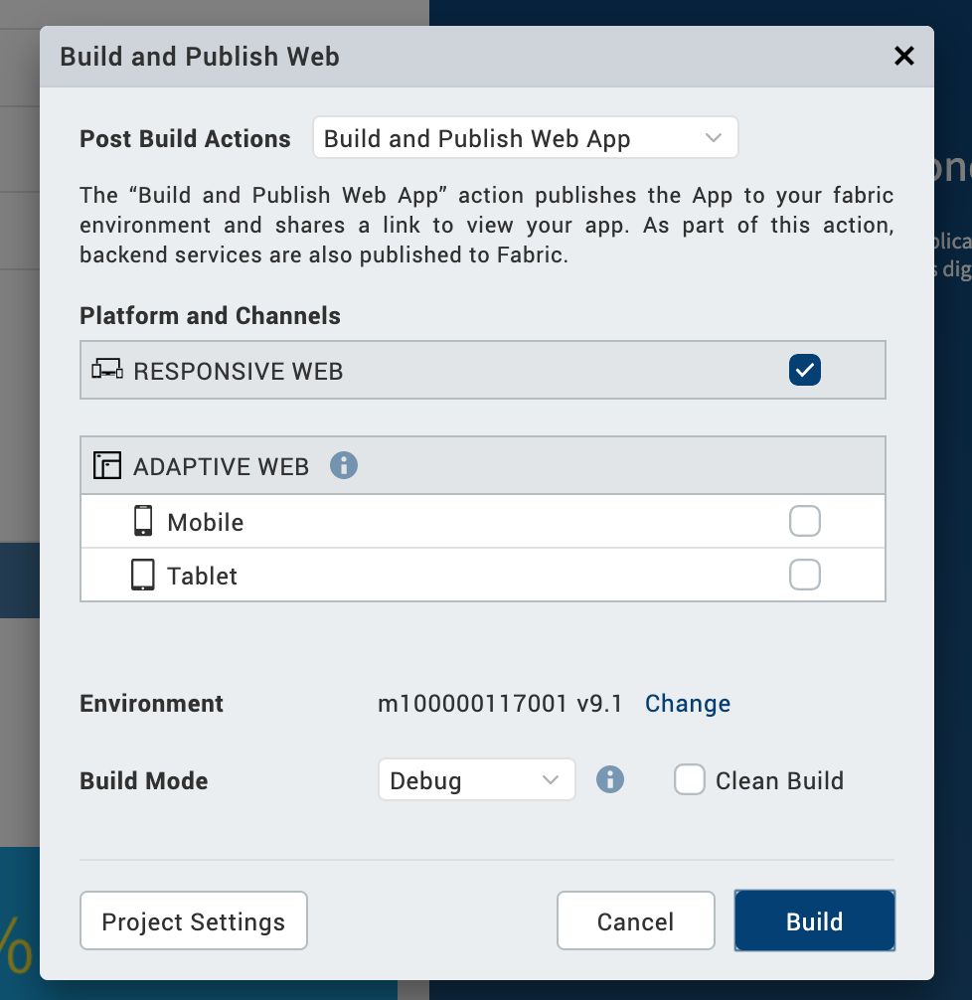

3. Once the build and publish is successful, you will see the application URL as below

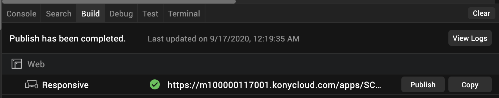

4. The Build Native Local is used to build the native apps. You can use the Post Build Action to direct Visualizer to generate the binaries, publish to Visualizer store or to run the app on simulators or devices connected to the developer’s machine.

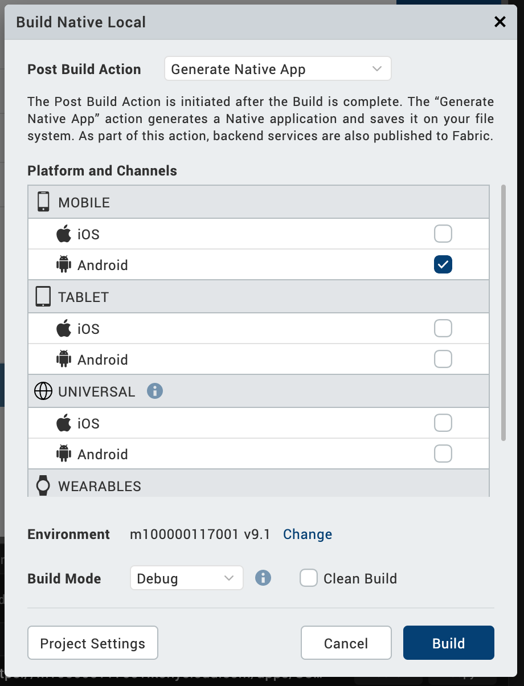 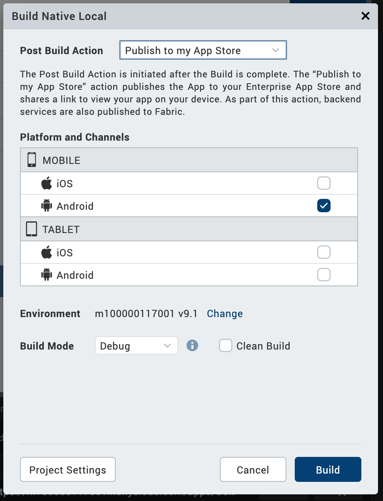 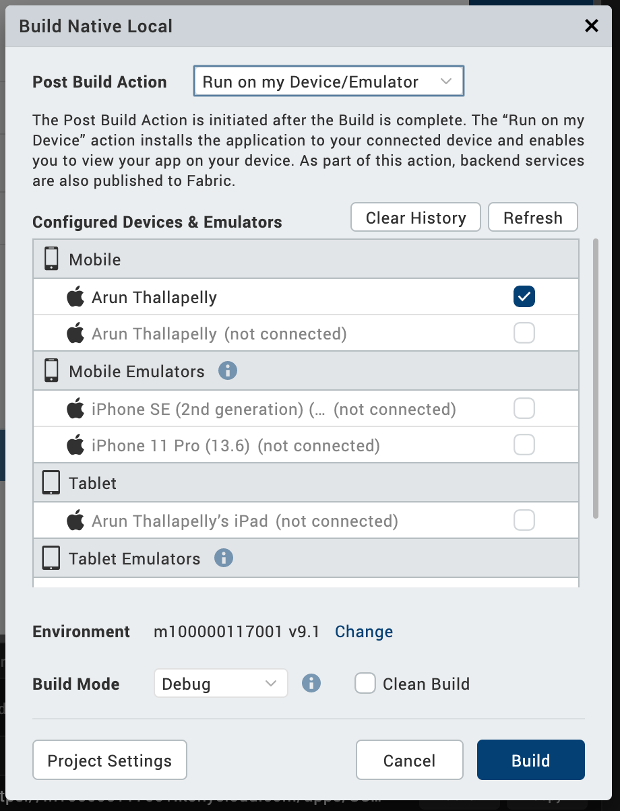

Please follow the prerequisites for iOS builds [here](https://docs.kony.com/konylibrary/visualizer/visualizer_user_guide/Default.htm#BuildAnAppForiOS.htm).
Please follow the prerequisites for Android builds [here](https://docs.kony.com/konylibrary/visualizer/visualizer_user_guide/Default.htm#BuildAnAppForAndroid.htm).

**Rate Temenos SCALE**

Let us know how we did via our [Feedback Survey](https://forms.office.com/Pages/ResponsePage.aspx?id=D1TS1Qr2rUWGqeLnku5maQm4GcDXBTFLrQ1exd1wB_1UOTY4SFZISzRLQjU4QVVRSjlUSzExRk1CNi4u)

Get Involved in the Temenos Developer Community at [Base Camp](https://basecamp.temenos.com/s/base-camp-welcome)
