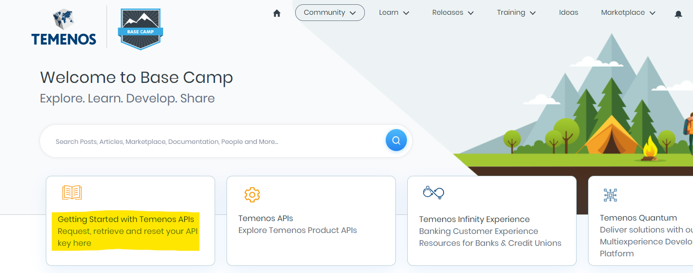
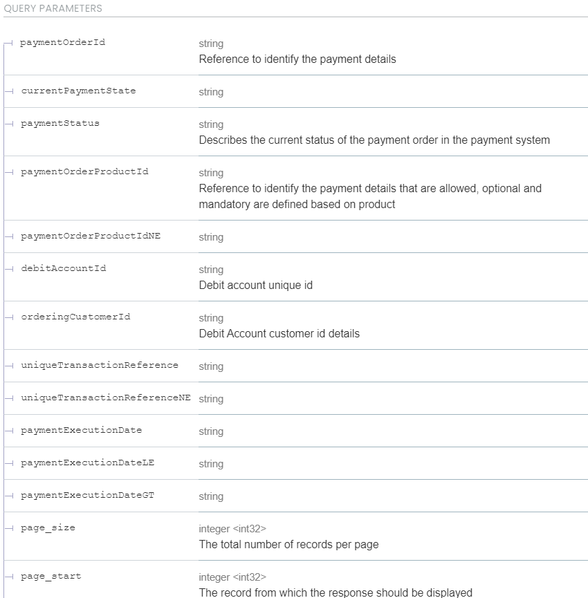
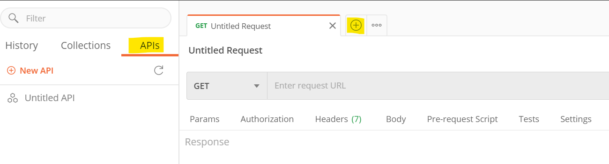
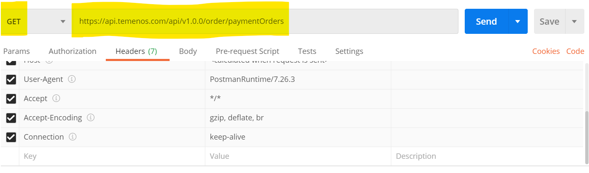
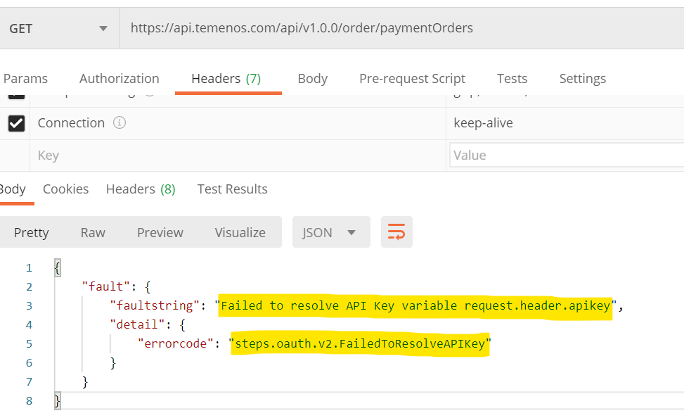
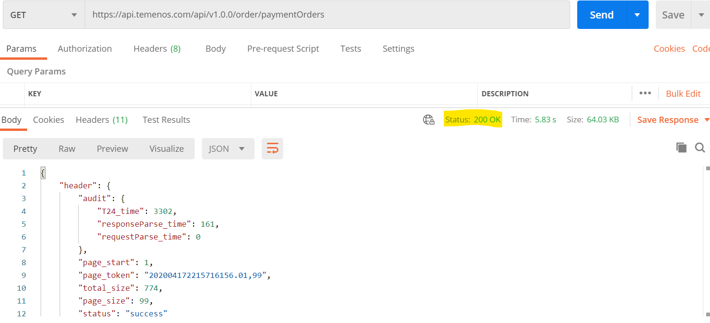

## Module One: Use a Payment API to retrieve finished payments

**Duration**: 7 mins

At the end of this lab you should be able to:
- Get details of all the payments executed 

**Generating an API Key**
1. An API Key is required to work with API’s available in https://apidocs.temenos.com/

2. API Key can be generated in the link https://basecamp.temenos.com/s/ (with a valid business email address)

3. Create a login in https://basecamp.temenos.com/s/

4. Once logged in click Getting Started with Temenos APIs 

5. Click Request Key link, once done you should receive the key in email.

**Retrieving Payment Orders**

1. To retrieve executed Payment, we are going to use the API getPaymentOrders

2. API doc link - https://apidocs.temenos.com/service/payment-orders#operation/getPaymentOrders

3. Query Parameters – Following are the query parameters with which this API can be executed

**Executing API in postman**

1. API link - https://api.temenos.com/api/v1.0.0/order/paymentOrders

2. In Postman click on APIs and then open a new tab on the right side

3. Specify the API link in postman 

4. Generated API Key in the previous step should be added in the Header

5. If API executed without API key, you will receive a ‘failedToResolveAPIKey’ error.

6. Click ‘Send’ in Postman to execute the API.

7. If executed successfully, Status will be 200 OK and the all Payment details will be available in body. 

**Module 1: Lab Summary**

In the first module, we executed an API to extract all the payment details

At this point, we will move on to [Module 2](https://github.com/temenos/SCALE2020/blob/main/Creating%20a%20Seamless%20Payment%20Experience%20Using%20Temenos%20Payment%20APIs/Module2-GetPaymentsBasedOnOrdering.md), where we will use the same API with query parameters to extract payment details of specific Ordering Customer.

**Rate Temenos SCALE**

Let us know how we did via our [Feedback Survey](https://forms.office.com/Pages/ResponsePage.aspx?id=D1TS1Qr2rUWGqeLnku5maQm4GcDXBTFLrQ1exd1wB_1UOTY4SFZISzRLQjU4QVVRSjlUSzExRk1CNi4u)

Get Involved in the Temenos Developer Community at [Base Camp](https://basecamp.temenos.com/s/base-camp-welcome)