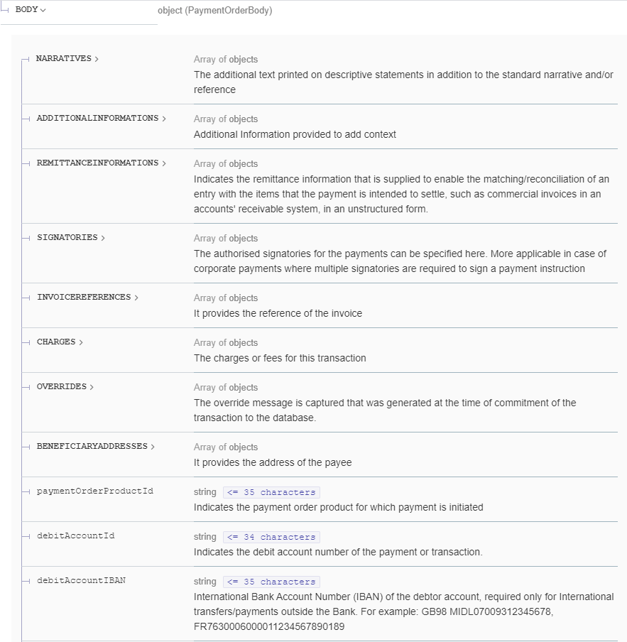
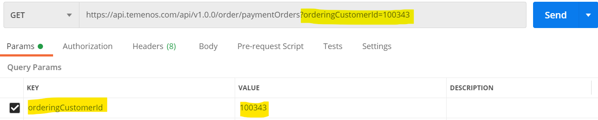

## Module 2: Retrieve a specific payment

**Duration**: 7 mins

At the end of this lab you should be able to:
- Get all payments executed for a Customer

**Get list of all Payments by Customer Number**
1. Retrieving Payment Orders

2. To retrieve Payments created for a customer, we are going to use the same API getPaymentOrders

3. API doc link - https://apidocs.temenos.com/service/payment-orders#operation/getPaymentOrders

4. Query Parameters – Following are the query parameters with which this API can be executed, we will be using the parameter `orderingCustomerId`

**Filtering using query parameter**

1. API link - https://api.temenos.com/api/v1.0.0/order/paymentOrders

2. Specify the API link in postman

3. To get list of all payments for a customer, add “?orderingCustomerId=<CustomerID>” in API link 
 
4. Click Send to execute API, it will get all Payments for ordering customer 100343.

**Module 2: Lab Summary**

In the second module, we executed an API to extract all the payment details for an ordering customer.

At this point, we will move on to [Module 3](https://github.com/temenos/SCALE2020/blob/main/Creating%20a%20Seamless%20Payment%20Experience%20Using%20Temenos%20Payment%20APIs/Module3-InitiateASepaPayment.md), we will initiate a SEPA payment transaction.

**Rate Temenos SCALE**

Let us know how we did via our [Feedback Survey](xx)