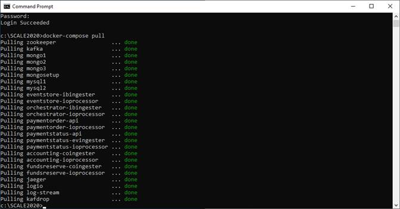
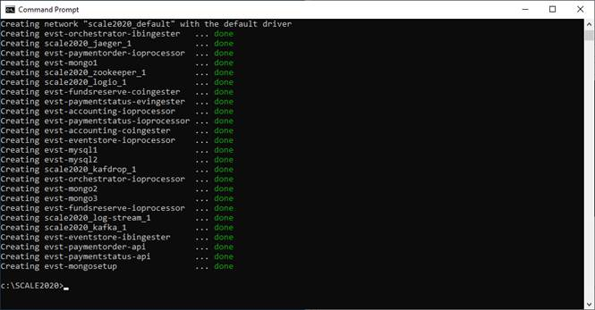

# Event Driven Microservices (Hands-on-Lab)
## Introduction
This document is intended to help setup and run the lab activities of Event Driven Microservices Hands-on-Lab in Temenos SCALE 2020. There are videos providing an overview of each Hands-on Lab on the SCALE event site. We recommend you watch the video before commencing the lab. 

This lab is demonstrated using a purpose-built application which runs on Event Driven Microservices Architecture with many microservices. This docker compose package is self contained with all required dependencies such as databases (MongoDB cluster and MySQL), streaming platform (Kafka), observability toolings (Jaeger, Kafdrop and logio) along with all required microservices. 

Apart from running the docker compose with sufficient resources as outlined below, there is no other dependency required.

As it's purpose-built for the demo with restrictions on resource requirements, this should only be used for the purpose of running through the lab.
## Requirements
### Docker
Docker (tested in version 19.03.08) with resources allocated as CPUs=4, Memory=12GB

If you are using Docker Desktop for Windows, the resources are configured under *Settings>Resources>Advanced*
### Http Client
curl, Postman or Insomnia
## Setup
### Docker compose
1. Download the **docker-compose.yml** file into a local dir say *C:/SCALE2020/*
2. In a command line tool (such as *cmd*), go into *C:/SCALE2020/*
3. Execute ***docker login --username 588b4143-3366-45a7-95da-71e7898b5a8c temninnohubscale2020.azurecr.io***
```
C:\SCALE2020>docker login --username 588b4143-3366-45a7-95da-71e7898b5a8c temninnohubscale2020.azurecr.io
Password:
```
4. Enter password CN__bQeVlavC_s085gzQpIU3blDmKRoOTg when prompted which should complete login - Note - Copy the password to the clipboard and paste ONCE into the command window as there is no visual indication that the password has been entered 
```
Login Succeeded
```
5. Execute ***docker-compose pull***. It should start pulling down the images. This usually takes about 20-30 mins, depends on the network.



```
C:\SCALE2020>docker-compose pull
```
6. Execute ***docker-compose up -d*** in the same command window as was used earlier. This would run the required docker containers.



```
C:\SCALE2020>docker-compose up -d
```
```
...
Creating network "scale2020_default" with the default driver
...
Creating scale2020_kafka_1              ... done
...
```
### Verifications
1. Check *Jaeger UI* for OpenTracing by accessing
```
http://localhost:16686/
```
2. Check *Kafka Cluster* by accessing
```
http://localhost:9000/
```
3. Check *Logs* by accessing (user: username1 password: password1)
```
http://localhost:6688/
```
## Executions
Create a payment (using curl or other http clients). Copy the Payment ID into the second API call otherwise a Failed message is received. 
```
curl --header "Content-Type: application/json" --data "{\"debitAccountId\": \"1111\", \"amount\": \"100\", \"creditAccountId\": \"1112\", \"paymentRef\": \"to my friend Alex\"}" --request POST http://localhost:8090/ms-paymentorder-api/api/v1.0.0/paymentorder
```
which should result in a response something like this
```
{"paymentId":"6eda6d32-92cb-44b5-81eb-b45805868c61","paymentRef":"to my friend Alex","paymentStatus":"OrderAccepted"}
```
Get a payment status (using curl or other http clients)
```
curl http://localhost:8091/ms-paymentstatus-api/api/v1.0.0/paymentstatus/6eda6d32-92cb-44b5-81eb-b45805868c61
```
which should result in response something like this
```
{"paymentId":"6eda6d32-92cb-44b5-81eb-b45805868c61","paymentAmount":100.00,"paymentStatus":"BookingCompleted"}
```
Note: Payment status is available only while the payment is processed by various services so it might take few seconds (depends on resource availability), especially as the first request.
## Troubleshooting
### Docker
1. It's possible that docker might have resource constraints, especially memory if not allocated 12GB. If you execute ***docker-compose ps*** which would provide a list of containers with all but one (evst-mongosetup) should be *Up*.
2. If Docker complaints of lack of volume space with error similar to *no space left on device*, perhaps there are dangling volumes that can be removed. To check dangling volumes, execute *docker volume ls -qf dangling=true* and remove those unwanted volumes

**Rate Temenos SCALE**

Let us know how we did via our [Feedback Survey](https://forms.office.com/Pages/ResponsePage.aspx?id=D1TS1Qr2rUWGqeLnku5maQm4GcDXBTFLrQ1exd1wB_1UOTY4SFZISzRLQjU4QVVRSjlUSzExRk1CNi4u)

Get Involved in the Temenos Developer Community at [Base Camp](https://basecamp.temenos.com/s/base-camp-welcome)