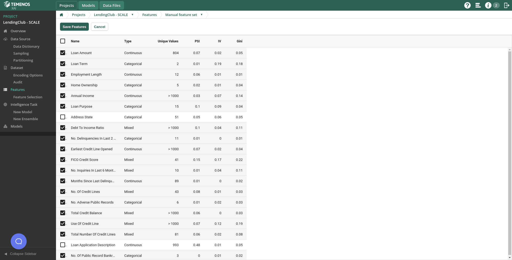
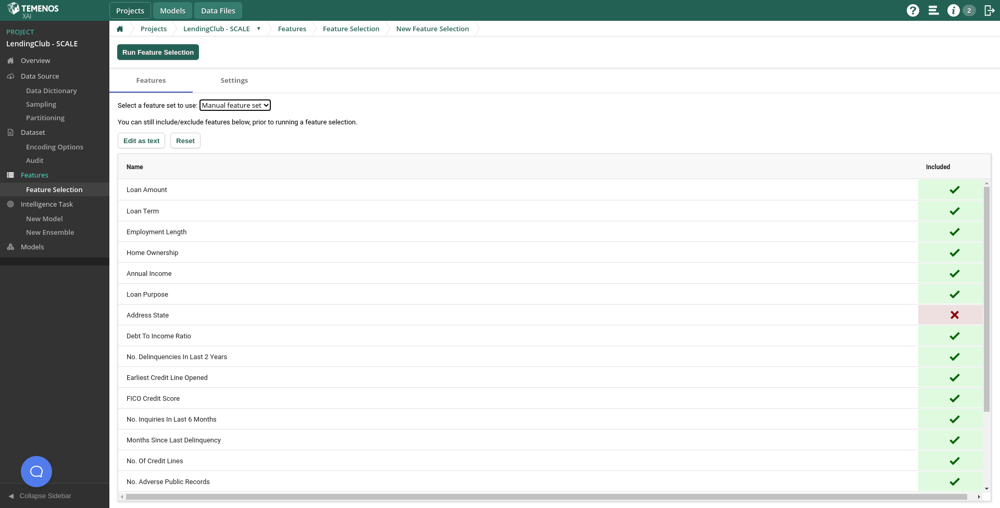
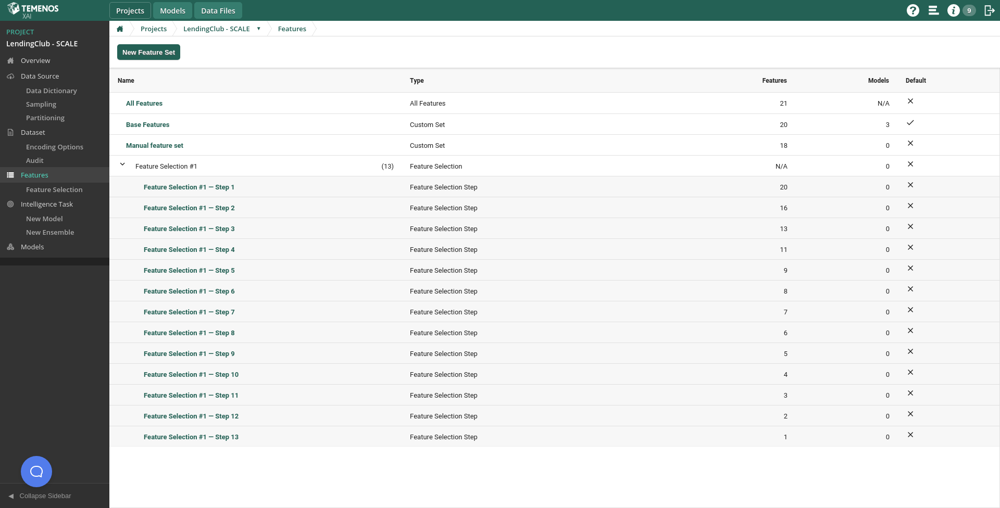

# Module 2: Selecting features (xAI)

**Duration**: 15 mins

**Prerequisite Software and Tools**

- Browser & Internet Access

Tasks: In this module you will be creating features sets, both manually and through feature selection, in order to build models. 

## Module 2: Lab Instructions

**Feature Selection workflow**

 
Figure 3: Illustrative workflow to select features to build a model.

Figure 3 depicts a descriptive workflow to select a subset of the available features that will be later used to build a model. As you can see, it’s usually a non-linear but rather iterative process.
 
1.	**Manually creating a feature set**
In your project, click on the “Features” section to have a look at the existing feature sets. By default, you will find two immutable feature sets:
- All features: this includes all columns/features that were uploaded, including the output target and ++any column that was removed during the audit process++.
- Base features: all columns that were not removed by the audit, excluding the output feature.
In order to manually create a feature set, click on the “New Feature Set” button and manually select the features you want to include/exclude using the toggle check-box next to each one of them. Then, click “Save Features” and assign a name to your feature set. 

2. **Feature Selection**

(I)

Features can also be selected automatically using machine learning algorithms. In your project, click on “Feature Selection” under “Features”, and you will be presented a list of all previously run feature selection jobs. If it is the first time you click on this page, it will be empty. Click on the “New Feature Selection” button. The dropdown list displays the initial feature set that will be fed to the feature selection algorithm. You can choose any feature set defined previously. For this lab, just make sure you use the “Base Features” feature set. In addition, in order to see the full power of the algorithm, go to the “Settings” tab in the Feature Selection screen, and set the parameter “Target number of features” to 1. The algorithm will reduce the initial feature set iteratively, from the selected initial feature set to the number specified here. Finally, click on “Run Feature Selection” and wait for the job to be finished.
 

(II)

Once the feature selection job finishes, you can find it in the “Feature Selection” screen. The process will display a series of feature sets, where each set resembles the previous one but with some extra features removed. The graph displays a value for expected performance using the feature set at every step. At each step of the process, you can see which features were removed, which remained and a score for each of them, representing the relative predictive relevance of each one of them. 
 

(III)

For every step of the feature selection process, a feature set will be created. Even though the steps of a feature selection cannot be modified, they can be copied in order to be edited. 
 

 
Continue to [Module Three: Building models – Focus on XAI](https://github.com/temenos/SCALE2020/blob/main/Training%20and%20Deploying%20Models%20with%20Temenos%20AI%20Platform/Module3-BuildingModulesFocusOnXAI.md)

**Rate Temenos SCALE**

Let us know how we did via our [Feedback Survey](xx)