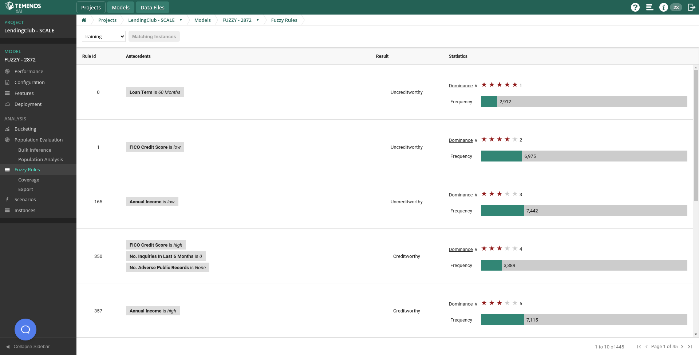
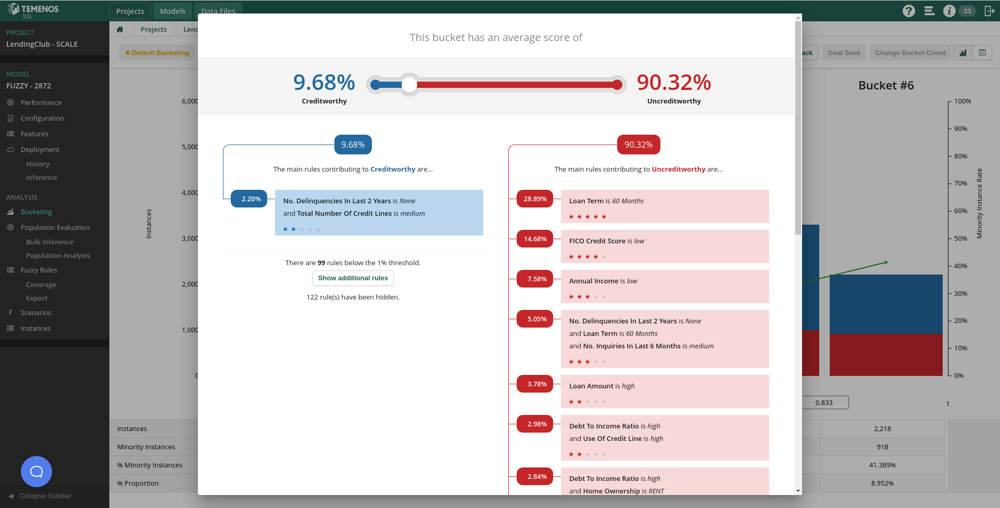
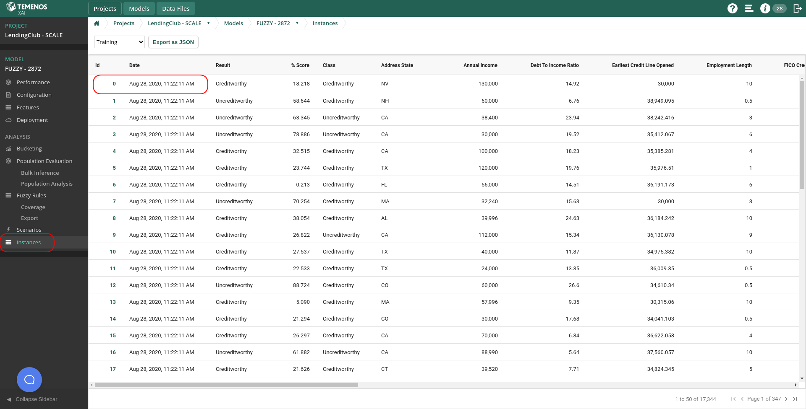
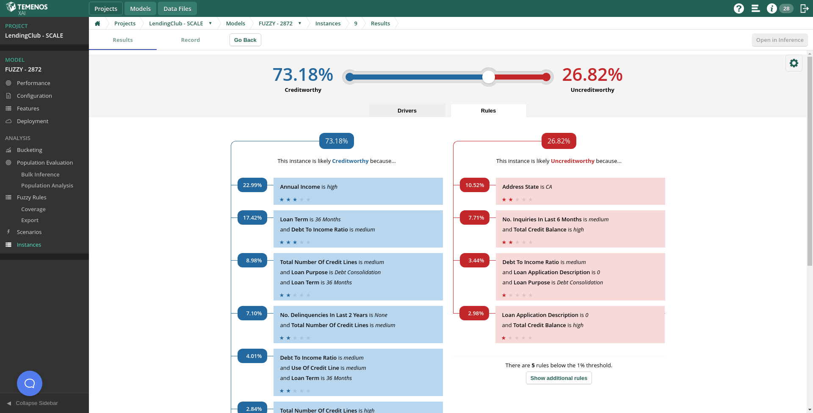
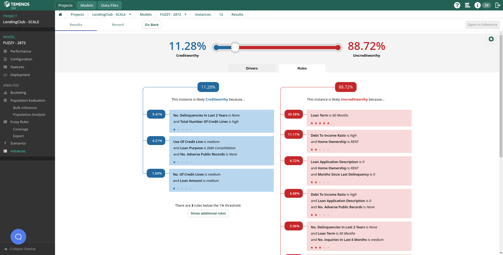

# Module 5: Interpretability

**Duration**: 15 mins

**Prerequisite Software and Tools**

- Browser & Internet Access
	
Tasks:	In this module you will learn about the three different levels of interpretability that can be obtained through an XAI model:
o	Population level.
o	Subpopulation level.
o	Individual level.

## Module 5: Lab Instructions

1.	**Interpretability at Population level: the rule base**
A fuzzy logic model is comprised of a rule base. These rules can be viewed in the “Fuzzy Rules” section once you have selected the model you are working on. 
These fuzzy IF-THEN rules are presented ranked by dominance. A rule’s dominance is a metric that combines the frequency (how frequently a pattern happens) and its confidence (when it happens, how confident we are it points to the right classification/decision). The IF part is a combination of one or many statements in the form “<feature> is <value>”, where those values are specified as linguistic labels. The consequent or result of the rule is the classification value it points to. 
As these rules and their dominance are extracted from the data, the rule base comprising the system offers the highest level of explainability, as it depicts a linguistic description of the entire population used to build the model. 

2. **Interpretability at subpopulation level: click-through-bucketing**
If you created a bucketing for your fuzzy logic model in previous steps, go to the corresponding screen. If you click on any bucket, the Platform will present an aggregation of all the rules that all instances in that bucket had fired. We call this functionality “click-through-bucketing”.
Hence, the click through bucketing can expose the most common rules/patterns in a given subpopulation of my data, according to how the model divides or segments the population using the score. From an interpretability perspective, this means I can get insights and descriptions about certain parts of my population, for instance, the worst loan applications getting the highest scores according to my model. 
This is the second level of interpretability.  

3. **Interpretability at individual level: single inference**
(I)
You can explore individually any instance that your model has evaluated, from the training set, the testing set or any other one that has been evaluated in a production environment. To do so, go to the “Instances” section withing your model. You will find two different views:
•	The “Rules View” will depict all rules the instance fired, and how much each one of them contributed to the final decision.
•	The “Drivers View” will offer a similar itemization but at a feature level, it is, much each feature and its specific value contributed to the classification.  

(II) A “good” decision
First, you can explore a “good” decision for a Creditworthy instance or loan application. Look for an instance that has a high score for “Creditworthy”.

(III) A “Bad” decision
Secondly, you can explore an instance with a “bad” or “Uncreditworthy” decision. Look for an instance that has a high “Uncreditworthy” score. 

Continue to [Module Six: Actionable Insights](https://github.com/temenos/SCALE2020/blob/main/Training%20and%20Deploying%20Models%20with%20Temenos%20AI%20Platform/Module6-ActionableInsights.md)
 
**Rate Temenos SCALE**

Let us know how we did via our [Feedback Survey](xx)