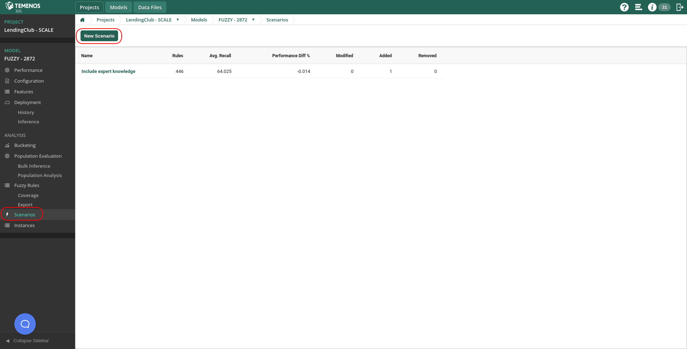
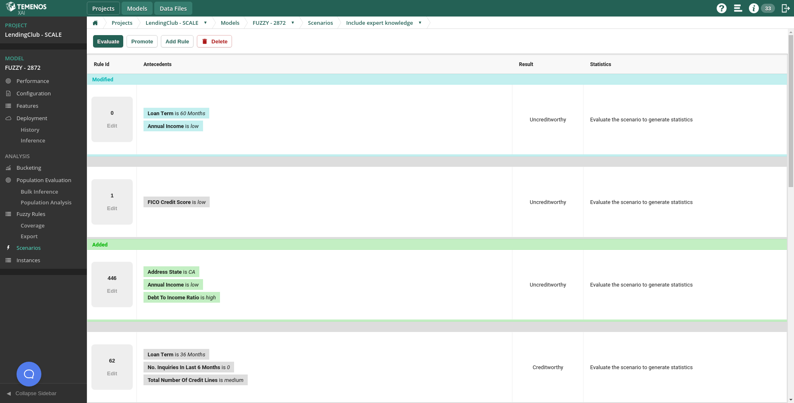
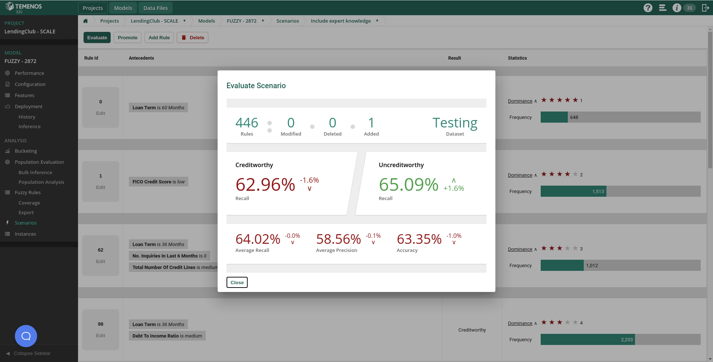
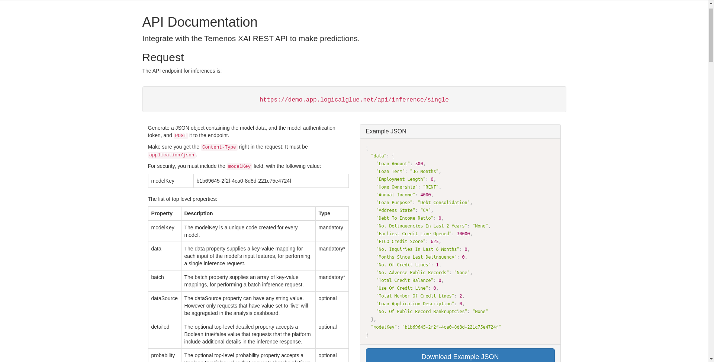
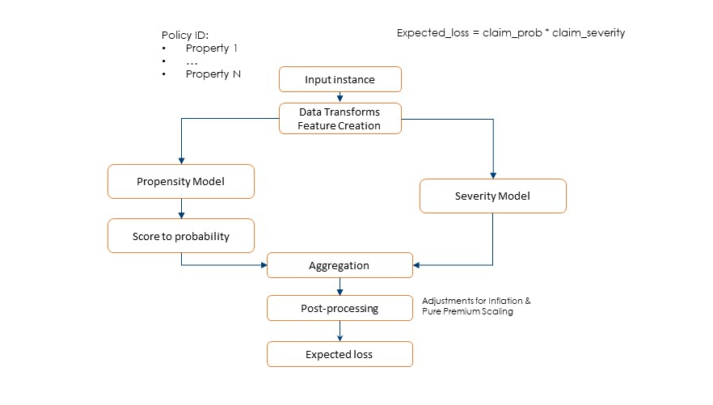

# Module 7 & 8: Including expert knowledge & Deployment and pipelines

**Duration**: 20 mins

**Prerequisite Software and Tools**

- Browser & Internet Access
	
Tasks: In this module you will learn how to use the “Scenario” functionality, allowing you to include expert domain knowledge into XAI models.

## Module 7: Lab Instructions

Another powerful tool in XAI is the ability to include expert knowledge in a data driven model. Sometimes, using XAI as we have done in previous modules might reveal some bias in your data: for instance, something related to a specific area/location, or maybe gender. And we might not be willing to base our business decisions on such unethical reasons. In addition, while the data we have collected for our business might cover the last 2-3 years, our knowledge about it might span for decades, and such knowledge might not be properly covered and represented in such recent and limited data. 

In this module we will explore how to include human expert knowledge in XAI systems. 
 
1. **Scenarios - Including your own rules**
(I)
In the context of your model, go to the “Scenarios” section, and click on “New Scenario”.

(II) 
Here, you can modify the rule base comprising your system in any way you want:
- You can create brand new rules from scratch, adding as many conditions as you want, and choosing both the rule’s result and its dominance.
- You can edit existing rules, by changing some of the conditions in the antecedent, modifying the result, or changing the dominance (i.e. how much the rule contributes to the decision if fired). 
- Finally, you can simply delete existing rules. 

(III)
Once you are done with editing your model, you can click on the “Evaluate” button, to how much those changes you have introduced affect your model performance on the testing data.

(IV)
Finally, you can click the “Promote” button to create a brand-new model out of this scenario, as if it had been built from scratch using data in a normal pipeline. The promoted model will be identical to the original one but including all manual changes you have previously introduced. 

# Module 8: Actionable Insights

**Duration**: 5 mins
	
Tasks: This module is just informative, in order to let the user know how to use deployed models in isolation or within a cascaded pipeline.

## Module 8: Lab Instructions

1. API – Model-specific auto-generated documentation

In the context of your model, go to the “Inference” section under “Deployment”. Now, at the top of the new tab in your browser, click on API documentation. 
Here you can see all model-specific documentation you will need to use your model in a live/production environment, including the API endpoint, model key, json payload and other options. You will also find information about the type of response you can expect to receive. 

2. Cascading models into complex pipelines

Models can be deployed not only in isolation, but also as part of a more complex pipeline to solve more complicated data science problems/tasks. These pipelines are use-case specific and have to be designed and addressed individually. The following figure depicts and existing pipeline for an insurance project, in which both a claim probability and a claim propensity models are used to calculated an expected loss, including aggregations across different properties within the same policy, to asses expected loss at a policy level. 

We hope you enjoyed this Hands-on lab. Why not try another while SCALE is running? 

**Rate Temenos SCALE**

Let us know how we did via our [Feedback Survey](https://forms.office.com/Pages/ResponsePage.aspx?id=D1TS1Qr2rUWGqeLnku5maQm4GcDXBTFLrQ1exd1wB_1UOTY4SFZISzRLQjU4QVVRSjlUSzExRk1CNi4u)

Get Involved in the Temenos Developer Community at [Base Camp](https://basecamp.temenos.com/s/base-camp-welcome)